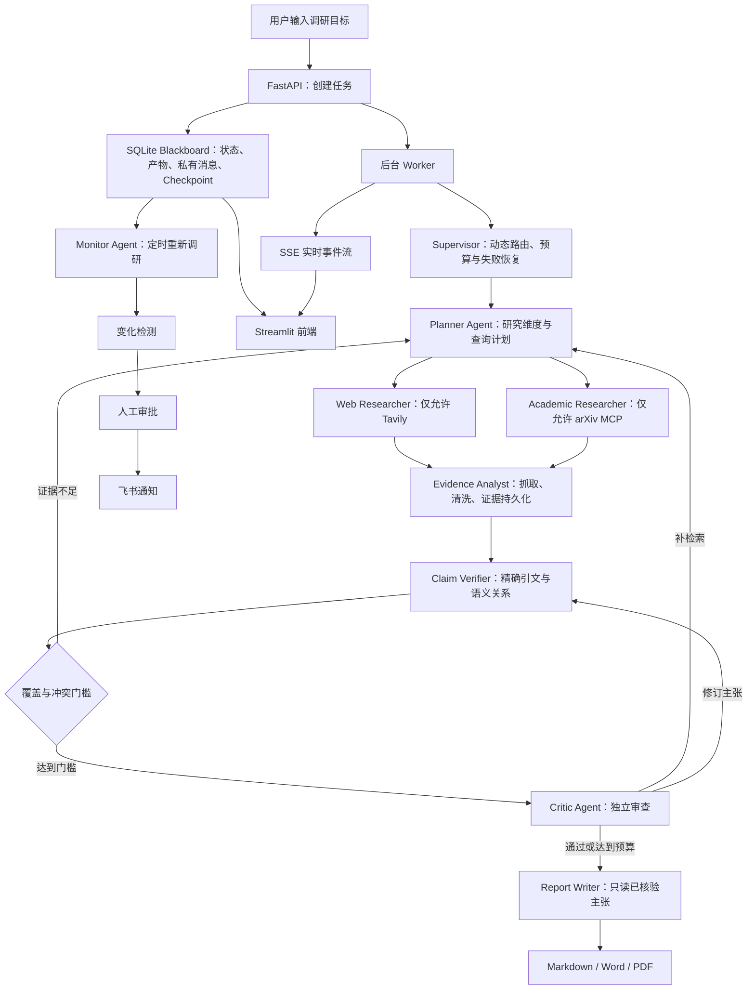

# InsightPilot

> 一个以证据为中心的实时多智能体情报调研与监控平台。

InsightPilot 将自然语言调研问题编排为一条可追溯的工作流：检索实时来源、提取并持久化证据、建立主张与证据的关联、审查不确定性，最后导出带引用的研究报告。适用于行业/市场调研、岗位情报、产品追踪和学术文献综述。

它不是仅查询本地资料的 RAG Demo。没有可用的实时检索服务时，系统会明确报错，不会把规则结果或缓存内容伪装成实时调研结论。

## 核心特性

- **实时网络调研**：通过 Tavily 搜索、并发抓取网页正文，并进行来源去重。
- **学术论文调研**：可选接入远程 Streamable HTTP MCP，自动路由到 arXiv 论文检索。
- **证据优先**：将来源 URL、检索时间、证据原文、主张和主张-证据关系持久化到 SQLite。
- **Supervisor Multi-Agent**：Planner、Web/Academic Researcher、Evidence Analyst、Claim Verifier、Critic 和 Report Writer 拥有独立目标、私有上下文、工具权限与结构化交接协议。
- **动态返工**：证据覆盖不足时自动重新规划与检索，Critic 可以要求补充来源或退回主张核验，并由轮次与质量门槛约束循环。
- **长期运行**：SQLite WAL 任务队列、节点级 checkpoint、Agent 隔离重试、服务重启恢复、定时监控、SSE 事件流和飞书通知审批。
- **安全与稳定性**：提示注入隔离、SSRF 防护、Provider 重试、JSON 结构化输出重试、报告降级和 MCP 敏感地址脱敏。
- **可视化产品界面**：FastAPI 后端、Streamlit 前端、证据图谱和 Markdown/Word/PDF 报告导出。

## 系统架构



## 调研流程

1. **Supervisor** 从共享 Blackboard 读取结构化交接，根据质量、错误和预算动态选择下一 Agent。
2. **Planner** 结合上一轮缺口、冲突和私有执行历史，生成不重复的查询计划。
3. **Web/Academic Researcher** 在代码级工具白名单内独立检索，不能核验主张或撰写报告。
4. **Evidence Analyst** 抓取页面、隔离提示注入、提取原文并持久化证据。
5. **Claim Verifier** 要求 `supporting_quote` 能在原文中精确匹配，并保存 `entailed/contradicted/partial/irrelevant` 语义关系。
6. 覆盖率、独立来源和冲突门槛不通过时，**Supervisor** 自动将任务返回 Planner 补检索。
7. **Critic** 可选择 `accept/search_more/revise_claims/partial`，从而改变后续执行路径。
8. 每个节点独立重试并写入 checkpoint；Provider 失败时切换研究 Agent、复用已保存证据或生成明确标注的部分报告。
9. **Report Writer** 无检索权限，只能读取已核验主张；报告还会经过引用完整性校验。

## 快速开始（Windows）

### 环境要求

- Python 3.11 或更高版本
- 一个 OpenAI-compatible 大模型 API Key（支持 DeepSeek 官方 API）
- 用于实时网络调研的 `TAVILY_API_KEY`
- 可选：用于 arXiv 文献调研的远程 Streamable HTTP MCP 地址

### 安装

```powershell
git clone <你的仓库地址>
cd InsightPilot
powershell -NoProfile -ExecutionPolicy Bypass -File .\scripts\setup.ps1
```

`setup.ps1` 会创建 `.venv`、安装开发依赖；本地没有 `.env` 时，还会由 `.env.example` 自动创建。

### 配置

复制 `.env.example` 为 `.env` 后填写必要配置。**不要提交 `.env`。**

```env
LLM_API_KEY=你的_API_Key
LLM_BASE_URL=https://api.deepseek.com
LLM_MODEL=deepseek-v4-flash
TAVILY_API_KEY=你的_Tavily_Key

# 本机单人使用可留空；局域网或公网部署必须设置为高强度随机值。
INSIGHTPILOT_API_TOKEN=

# 推理模型的该预算包含内部推理 Token。
INSIGHTPILOT_REPORT_MAX_TOKENS=8192
INSIGHTPILOT_JSON_MAX_TOKENS=4096
INSIGHTPILOT_JSON_RETRY_MAX_TOKENS=8192
INSIGHTPILOT_AGENT_RETRIES=2
INSIGHTPILOT_VERIFIER_BATCH_SIZE=3
INSIGHTPILOT_MAX_VERIFICATION_EVIDENCE=12
INSIGHTPILOT_FOLLOWUP_VERIFICATION_EVIDENCE=6
INSIGHTPILOT_MAX_AGENT_STEPS=30
INSIGHTPILOT_MAX_SEARCH_ROUNDS=3
INSIGHTPILOT_MAX_REVISION_ROUNDS=2
INSIGHTPILOT_MIN_EVIDENCE_COVERAGE=0.72
INSIGHTPILOT_MIN_VERIFIED_CLAIMS=3
INSIGHTPILOT_MIN_UNIQUE_SOURCES=3

# 可选：arXiv 远程 MCP 地址
MODELSCOPE_ARXIV_MCP_URL=
```

若使用其他 OpenAI-compatible 服务，只需将 `LLM_BASE_URL` 和 `LLM_MODEL` 替换为该服务实际支持的值。

`INSIGHTPILOT_API_TOKEN` 配置后，Streamlit 会先显示登录页，FastAPI 的全部业务接口也会校验同一个 Bearer Token。未配置时，API 只接受来自本机回环地址的请求。可使用密码管理器生成至少 32 字节的随机值，不要把 Token 写入 README、截图或提交记录。

### 启动

```powershell
powershell -NoProfile -ExecutionPolicy Bypass -File .\scripts\start-all.ps1
```

- 前端界面：`http://127.0.0.1:8501`
- API 文档：`http://127.0.0.1:8000/docs`
- 健康检查：`http://127.0.0.1:8000/api/v1/health`

配置 Token 后，直接调用 API 时需要携带请求头：

```text
Authorization: Bearer <INSIGHTPILOT_API_TOKEN>
```

### 可选依赖

```powershell
# 支持 JavaScript 重度网页，需要首次下载 Chromium
powershell -NoProfile -ExecutionPolicy Bypass -File .\scripts\install-browser.ps1

# 使用远程 MCP 前安装 MCP SDK
powershell -NoProfile -ExecutionPolicy Bypass -File .\scripts\install-mcp.ps1
```

启动后可以检查 MCP 连接和工具发现状态：

```text
http://127.0.0.1:8000/api/v1/mcp/status
http://127.0.0.1:8000/api/v1/mcp/tools
```

## 大模型可靠性

部分推理模型会在输出可见正文前消耗 Token 进行内部推理。InsightPilot 为报告单独设置了输出上限，默认使用 `INSIGHTPILOT_REPORT_MAX_TOKENS=8192`；当流式请求为空时，会自动降级为普通请求重试。

结构化输出首次使用 Provider 的 JSON 模式；出现空响应或格式错误后，会关闭强制 JSON 模式并逐步提高输出预算。Claim Verifier 按来源质量和来源多样性选择证据，默认每批 3 条；单批失败时只拆分该批继续核验，不会丢弃其他成功批次。任务恢复会优先返回最近失败的 Agent。

若 Provider 仍连续返回空正文，系统才会基于已核验主张、证据 ID 和真实来源生成“证据模板报告”。若已有候选证据但尚无已核验主张，系统会生成 `unverified_evidence` 部分报告，明确区分“已检索但未核验”和“没有检索结果”。任务事件会记录实际生成方式，不会把降级结果冒充为模型正常生成结果。

## 主要 API

| 方法 | 接口 | 说明 |
| --- | --- | --- |
| `POST` | `/api/v1/tasks` | 创建调研任务 |
| `GET` | `/api/v1/tasks/{id}` | 获取任务状态和结果 |
| `GET` | `/api/v1/tasks/{id}/events/stream` | 订阅 SSE 实时事件 |
| `GET` | `/api/v1/tasks/{id}/agent-trace` | 查看 Agent 权限、独立执行、结构化交接、路由和 checkpoint |
| `POST` | `/api/v1/tasks/{id}/retry` | 从最近失败 Agent 或持久化检查点恢复 |
| `GET` | `/api/v1/tasks/{id}/evidence-graph` | 获取主张、证据及关联图谱 |
| `POST` | `/api/v1/monitors` | 创建定时监控任务 |
| `GET` | `/api/v1/approvals` | 查看待审批的外部操作 |
| `POST` | `/api/v1/approvals/{id}/decision` | 批准或拒绝通知 |
| `GET` | `/api/v1/mcp/status` | 检查远程 MCP 连接 |
| `GET` | `/api/v1/mcp/tools` | 查看发现到的 MCP 工具 |

## 质量验证

```powershell
cd InsightPilot
.\.venv\Scripts\python.exe -m pytest tests -q
.\.venv\Scripts\python.exe -m compileall -q python
```

测试覆盖工具权限隔离、Agent 私有上下文、共享 checkpoint、Verifier 驳回后的动态补检索、失败批次拆分、精确引文校验、失败节点恢复、来源质量排序、任务持久化、证据图谱关联、SSRF 防护、通知审批、Streamable HTTP MCP 发现与调用、结构化输出自适应重试和报告降级。

## 项目结构

```text
frontend/                 Streamlit 产品界面
python/insightpilot/
  api.py                  FastAPI 与 SSE 接口
  runtime.py              Worker、调度器、监控与通知审批
  multi_agent.py          Agent 协议、共享状态、工具权限与执行日志
  research_agents.py      独立研究 Agent 与 Supervisor 动态路由
  research_pipeline.py    显式状态机、领域工具和失败恢复
  providers.py            LLM/Tavily Provider 与重试处理
  academic_research.py    arXiv MCP 路由与论文结果规范化
  mcp_client.py           stdio 与 Streamable HTTP MCP 客户端
  database.py             Blackboard、Checkpoint、Agent Trace 与证据持久化
  network_security.py     外部请求安全防护
.insightpilot/            可复用 Agent 定义与调研 Skills
scripts/                  Windows 环境配置与启动脚本
tests/                    产品与 MCP 集成测试
```

## 适用边界

- 未配置实时检索 Provider 时，任务会明确失败，不会伪造实时结论。
- arXiv MCP 是可选论文检索来源，不能代替新闻、公司、政策和产品信息检索。
- 网页内容属于不可信外部数据，可能不完整、有偏差、过时或错误。
- SQLite 适用于本地单机；生产多实例部署应替换为 PostgreSQL 与 Redis/Celery，并增加身份认证和权限控制。
- 当前采用中心化 Supervisor/Blackboard Multi-Agent 架构，不是去中心化群体智能；Supervisor 对循环、预算和最终路由拥有控制权。
- 大模型输出可能错误。用于重要决策前，必须依据关联证据和原始来源人工复核。

## 安全与仓库卫生

`.env`、`.mcp.json`、`.venv/`、`data/`、`reports/`、Streamlit 密钥文件和 IDE 配置均已被 `.gitignore` 忽略。API Key、访问 Token、Webhook URL 和托管 MCP URL 都应按敏感凭据处理。

本机默认监听 `127.0.0.1`。部署到局域网、容器或云服务器前，必须配置 `INSIGHTPILOT_API_TOKEN`，并在反向代理层启用 HTTPS；该单 Token 方案适合个人部署，生产多用户环境仍需账号体系、权限控制和审计日志。

公开推送前可执行：

```powershell
git status
git check-ignore .env .mcp.json data\insightpilot.db
```

## 致谢与许可证

InsightPilot 包含基于 [Windy3f3f3f3f/claude-code-from-scratch](https://github.com/Windy3f3f3f3f/claude-code-from-scratch) 适配的通用 Agent 组件。原项目的 MIT 版权声明已保留在 [LICENSE](LICENSE)，详见 [NOTICE.md](NOTICE.md)。

本项目以 MIT License 发布。
