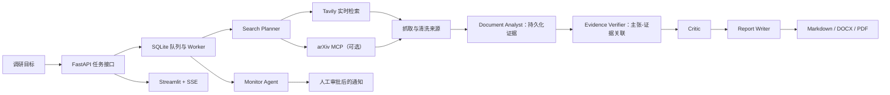

# InsightPilot

> 一个以证据为中心的实时多智能体情报调研与监控平台。

InsightPilot 将自然语言调研问题编排为一条可追溯的工作流：检索实时来源、提取并持久化证据、建立主张与证据的关联、审查不确定性，最后导出带引用的研究报告。适用于行业/市场调研、岗位情报、产品追踪和学术文献综述。

它不是仅查询本地资料的 RAG Demo。没有可用的实时检索服务时，系统会明确报错，不会把规则结果或缓存内容伪装成实时调研结论。

## 核心特性

- **实时网络调研**：通过 Tavily 搜索、并发抓取网页正文，并进行来源去重。
- **学术论文调研**：可选接入远程 Streamable HTTP MCP，自动路由到 arXiv 论文检索。
- **证据优先**：将来源 URL、检索时间、证据原文、主张和主张-证据关系持久化到 SQLite。
- **多智能体流水线**：Search Planner、Web/Academic Researcher、Document Analyst、Evidence Verifier、Critic、Report Writer、Monitor Agent。
- **长期运行**：SQLite WAL 任务队列、服务重启恢复、定时监控、SSE 事件流和飞书通知审批。
- **安全与稳定性**：提示注入隔离、SSRF 防护、Provider 重试、JSON 结构化输出重试、报告降级和 MCP 敏感地址脱敏。
- **可视化产品界面**：FastAPI 后端、Streamlit 前端、证据图谱和 Markdown/Word/PDF 报告导出。

## 系统架构



## 调研流程

1. **Supervisor** 创建并持久化任务，识别是否属于学术调研。
2. **Search Planner** 将目标拆解为相互补充的高质量查询词。
3. **Web Researcher** 调用 Tavily；学术任务还可通过远程 MCP 调用 arXiv。
4. **Document Analyst** 抓取页面、提取可引用证据、去重并保留来源信息。
5. **Evidence Verifier** 只生成能够关联到真实 `evidence_id` 的主张。
6. **Critic** 审查证据缺口、来源偏差、时效性和结论边界。
7. **Report Writer** 生成带引用的 Markdown 报告，并导出 DOCX/PDF。
8. **Monitor Agent** 定期重新调研，检测变化；对外通知必须先经人工审批。

## 快速开始（Windows）

### 环境要求

- Python 3.11 或更高版本
- 一个 OpenAI-compatible 大模型 API Key（支持 DeepSeek 官方 API）
- 用于实时网络调研的 `TAVILY_API_KEY`
- 可选：用于 arXiv 文献调研的远程 Streamable HTTP MCP 地址

### 安装

```powershell
git clone <你的仓库地址>
cd InsightPilot
powershell -NoProfile -ExecutionPolicy Bypass -File .\scripts\setup.ps1
```

`setup.ps1` 会创建 `.venv`、安装开发依赖；本地没有 `.env` 时，还会由 `.env.example` 自动创建。

### 配置

复制 `.env.example` 为 `.env` 后填写必要配置。**不要提交 `.env`。**

```env
LLM_API_KEY=你的_API_Key
LLM_BASE_URL=https://api.deepseek.com
LLM_MODEL=deepseek-v4-flash
TAVILY_API_KEY=你的_Tavily_Key

# 推理模型的该预算包含内部推理 Token。
INSIGHTPILOT_REPORT_MAX_TOKENS=8192

# 可选：arXiv 远程 MCP 地址
MODELSCOPE_ARXIV_MCP_URL=
```

若使用其他 OpenAI-compatible 服务，只需将 `LLM_BASE_URL` 和 `LLM_MODEL` 替换为该服务实际支持的值。

### 启动

```powershell
powershell -NoProfile -ExecutionPolicy Bypass -File .\scripts\start-all.ps1
```

- 前端界面：`http://127.0.0.1:8501`
- API 文档：`http://127.0.0.1:8000/docs`
- 健康检查：`http://127.0.0.1:8000/api/v1/health`

### 可选依赖

```powershell
# 支持 JavaScript 重度网页，需要首次下载 Chromium
powershell -NoProfile -ExecutionPolicy Bypass -File .\scripts\install-browser.ps1

# 使用远程 MCP 前安装 MCP SDK
powershell -NoProfile -ExecutionPolicy Bypass -File .\scripts\install-mcp.ps1
```

启动后可以检查 MCP 连接和工具发现状态：

```text
http://127.0.0.1:8000/api/v1/mcp/status
http://127.0.0.1:8000/api/v1/mcp/tools
```

## 大模型可靠性

部分推理模型会在输出可见正文前消耗 Token 进行内部推理。InsightPilot 为报告单独设置了输出上限，默认使用 `INSIGHTPILOT_REPORT_MAX_TOKENS=8192`；当流式请求为空时，会自动降级为普通请求重试。

若 Provider 仍连续返回空正文，系统才会基于已核验主张、证据 ID 和真实来源生成“证据模板报告”。任务事件会明确记录报告生成方式为 `llm` 或 `evidence_fallback`，不会把降级结果冒充为模型正常生成结果。

## 主要 API

| 方法 | 接口 | 说明 |
| --- | --- | --- |
| `POST` | `/api/v1/tasks` | 创建调研任务 |
| `GET` | `/api/v1/tasks/{id}` | 获取任务状态和结果 |
| `GET` | `/api/v1/tasks/{id}/events/stream` | 订阅 SSE 实时事件 |
| `GET` | `/api/v1/tasks/{id}/evidence-graph` | 获取主张、证据及关联图谱 |
| `POST` | `/api/v1/monitors` | 创建定时监控任务 |
| `GET` | `/api/v1/approvals` | 查看待审批的外部操作 |
| `POST` | `/api/v1/approvals/{id}/decision` | 批准或拒绝通知 |
| `GET` | `/api/v1/mcp/status` | 检查远程 MCP 连接 |
| `GET` | `/api/v1/mcp/tools` | 查看发现到的 MCP 工具 |

## 质量验证

```powershell
cd InsightPilot
.\.venv\Scripts\python.exe -m pytest tests -q
.\.venv\Scripts\python.exe -m compileall -q python
```

测试覆盖任务持久化、证据图谱关联、SSRF 防护、通知审批、Streamable HTTP MCP 发现与调用、论文结果规范化、结构化输出重试和报告降级。

## 项目结构

```text
frontend/                 Streamlit 产品界面
python/insightpilot/
  api.py                  FastAPI 与 SSE 接口
  runtime.py              Worker、调度器、监控与通知审批
  research_pipeline.py    多智能体调研编排
  providers.py            LLM/Tavily Provider 与重试处理
  academic_research.py    arXiv MCP 路由与论文结果规范化
  mcp_client.py           stdio 与 Streamable HTTP MCP 客户端
  database.py             任务、来源、证据、主张的 SQLite 持久化
  network_security.py     外部请求安全防护
.insightpilot/            可复用 Agent 定义与调研 Skills
scripts/                  Windows 环境配置与启动脚本
tests/                    产品与 MCP 集成测试
```

## 适用边界

- 未配置实时检索 Provider 时，任务会明确失败，不会伪造实时结论。
- arXiv MCP 是可选论文检索来源，不能代替新闻、公司、政策和产品信息检索。
- 网页内容属于不可信外部数据，可能不完整、有偏差、过时或错误。
- SQLite 适用于本地单机；生产多实例部署应替换为 PostgreSQL 与 Redis/Celery，并增加身份认证和权限控制。
- 大模型输出可能错误。用于重要决策前，必须依据关联证据和原始来源人工复核。

## 安全与仓库卫生

`.env`、`.mcp.json`、`.venv/`、`data/`、`reports/`、Streamlit 密钥文件和 IDE 配置均已被 `.gitignore` 忽略。API Key、Webhook URL 和托管 MCP URL 都应按敏感凭据处理。

公开推送前可执行：

```powershell
git status
git check-ignore .env .mcp.json data\insightpilot.db
```

## 致谢与许可证

InsightPilot 包含基于 [Windy3f3f3f3f/claude-code-from-scratch](https://github.com/Windy3f3f3f3f/claude-code-from-scratch) 适配的通用 Agent 组件。原项目的 MIT 版权声明已保留在 [LICENSE](LICENSE)，详见 [NOTICE.md](NOTICE.md)。

本项目以 MIT License 发布。
